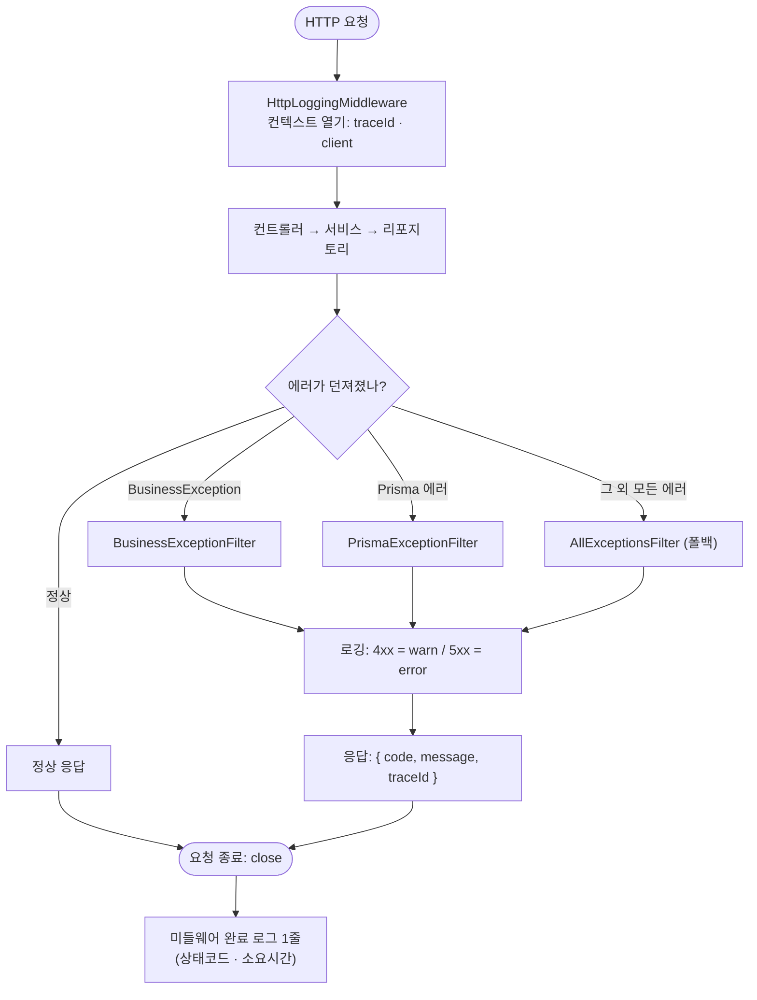
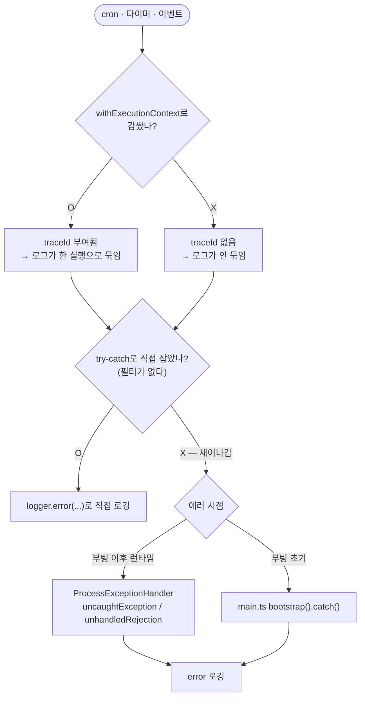
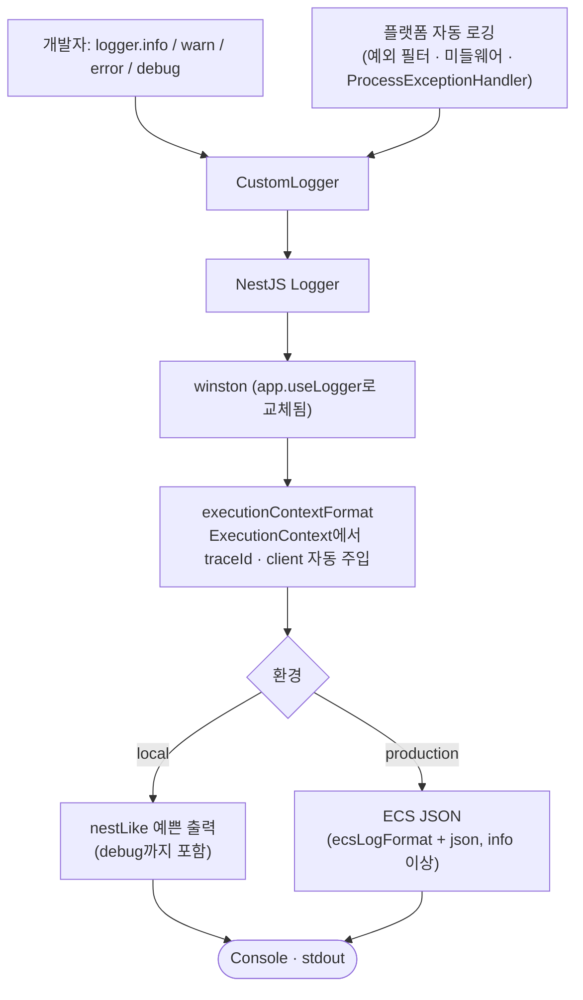

# common — 로깅 · 에러 · 실행 컨텍스트

이 폴더는 **"로그·에러는 개발자가 신경 쓰지 않아도 알아서 된다"**를 만드는 플랫폼 코드다.
서비스 코드에서 할 일은 딱 두 가지뿐이다.

- 정상 흐름을 남기고 싶으면 → `logger.info(...)` ([logger](./logger/read.md))
- 실패를 알리고 싶으면 → `throw new BusinessException(...)` ([exception](./exception/read.md))

`traceId`, `client.ip`, 4xx/5xx 구분, 클라이언트 응답 형태는 **전부 자동**이다. 그 "자동"이 어떻게 굴러가는지가 이 문서다.

## 하위 폴더

| 폴더 | 무엇 | 개발자가 직접 쓰나 |
| --- | --- | --- |
| [logger](./logger/read.md) | 로그 찍기 (`CustomLogger`) | ✅ 매일 씀 |
| [exception](./exception/read.md) | 에러 던지기 (`BusinessException`) | ✅ 자주 씀 |
| [context](./context/read.md) | 실행 컨텍스트 (`ExecutionContext`) | ⛔ 거의 안 씀 (cron일 때만) |

## 전체 그림: 요청 하나가 흐르는 길

```
HTTP 요청
  │
  ├─ HttpLoggingMiddleware (logger/httpLogging.middleware.ts)
  │    · requestId 생성/전파(x-request-id) → traceId로 사용
  │    · client.ip / user_agent 수집
  │    · withExecutionContext(...)로 컨텍스트를 열고 next() 호출  ◀─┐
  │                                                                  │ 이 안에서 찍는
  ├─ 컨트롤러 → 서비스 → 리포지토리                                  │ 모든 로그에
  │    · logger.info(...)  →  traceId·client가 자동으로 붙음   ─────┘ 자동 주입
  │    · throw new BusinessException(...)
  │
  ├─ 예외 필터 (요청 안에서 던져진 에러를 여기서 잡음)
  │    · BusinessExceptionFilter  → 우리가 정의한 에러
  │    · PrismaExceptionFilter    → DB 에러
  │    · AllExceptionsFilter      → 그 외 전부 (폴백)
  │        → 로깅(4xx=warn / 5xx=error) + { code, message, traceId } 응답
  │
  └─ 요청 종료(close) → 미들웨어가 완료 로그 1줄 (상태코드·소요시간)
```

## 흐름도

### 에러 처리 — HTTP 요청

요청 안에서 던져진 에러는 **전역 예외 필터**가 종류별로 잡아 로깅·응답까지 끝낸다. 서비스는 던지기만 한다.



### 에러 처리 — HTTP 밖 (cron · 타이머 · 이벤트)

여기엔 **미들웨어도 필터도 없다.** 컨텍스트를 직접 열고, try-catch로 직접 잡아야 한다. 그래도 새어나간 에러는 프로세스 레벨 방어선이 잡는다.



### 로그 처리 — 공통 파이프라인

개발자가 찍은 로그든 플랫폼이 자동으로 남긴 로그든, **같은 파이프라인**을 탄다. `traceId`·`client`는 여기서 주입되고, 출력 형식만 환경에 따라 갈린다.



## 핵심 원리 1 — traceId·client.ip는 왜 자동으로 붙나

`AsyncLocalStorage`(Node 내장) 덕분이다. ([context/executionContext.ts](./context/executionContext.ts))

미들웨어가 요청 진입점에서 `withExecutionContext({ traceId, client, ... }, () => next())`로 **요청 전체를 감싼다.** 그러면 그 안에서 실행되는 모든 하위 코드(컨트롤러·서비스·리포지토리)는 **인자로 넘기지 않아도** 같은 저장소를 들여다볼 수 있다.

로그를 찍을 때 winston 포맷(`logger/winston.config.ts`)이 이 저장소에서 `traceId`·`client`를 꺼내 자동으로 붙인다. **그래서 개발자는 `logger.info('메시지')`만 찍으면 되고, `traceId`를 직접 넣으면 안 된다**(중복/오염).

> 한 요청의 모든 로그가 같은 `trace.id`로 묶이므로, 사용자 문의 시 응답의 `traceId` 하나로 그 요청의 로그 전체를 찾을 수 있다.

## 핵심 원리 2 — 에러 로깅/응답을 왜 직접 안 하나

**예외 필터가 전담**하기 때문이다. 서비스는 던지기만 하면 된다.

전역 필터는 `app.module.ts`에 등록되며, **NestJS는 등록의 역순으로 매칭**한다. 그래서 catch-all을 맨 위, 전용 필터를 아래에 둔다.

| 필터 | 담당 | 응답 |
| --- | --- | --- |
| `BusinessExceptionFilter` | 우리가 정의한 `BusinessException` | 정의된 status + `{ code, message, traceId }` |
| `PrismaExceptionFilter` | Prisma 에러(P2002 등) | 알려진 건 4xx, 나머지 500 |
| `AllExceptionsFilter` | 그 외 전부 (폴백) | HttpException은 그대로, 예상 못 한 건 500으로 감싸 내부정보 은닉 |

세 필터 모두 **4xx는 warn / 5xx는 error**로 로깅한다. (예상된 실패가 알람에서 실제 장애를 묻지 않도록.)

## 핵심 원리 3 — HTTP 밖(cron 등)은 예외다

필터도 미들웨어도 **HTTP 요청에만** 동작한다. cron·타이머·이벤트에는 컨텍스트를 여는 미들웨어가 없고, 던진 예외를 잡는 필터도 없다. 그래서 HTTP 밖 작업은 직접 챙겨야 한다.

- 컨텍스트를 직접 열어라 → `withExecutionContext({}, async () => { ... })` ([context](./context/read.md))
- try-catch로 직접 잡아 로깅하라 (필터가 없으므로) ([exception](./exception/read.md) 하단)

그래도 아무도 못 잡고 새어나온 에러는 **최종 방어선**이 잡는다.

- 앱 부팅 이후 런타임 → `ProcessExceptionHandler` (`uncaughtException`/`unhandledRejection`)
- 부팅 초기(핸들러 등록 전) → `main.ts`의 `bootstrap().catch()`

## 로그 형식 (ECS)

모든 로그는 [ECS](https://www.elastic.co/guide/en/ecs/current/index.html)(Elastic Common Schema) 형식으로 나간다. 개발자가 채우는 자리는 **`labels` 하나**뿐이고, `trace`·`error`·`event`·`http` 같은 예약 필드는 플랫폼(필터·미들웨어·핸들러)이 채운다. 자세한 건 [logger/read.md](./logger/read.md).

## 더 읽기

- 로그 찍는 법 → [logger/read.md](./logger/read.md)
- 에러 던지는 법 → [exception/read.md](./exception/read.md)
- 실행 컨텍스트 (cron 등) → [context/read.md](./context/read.md)
