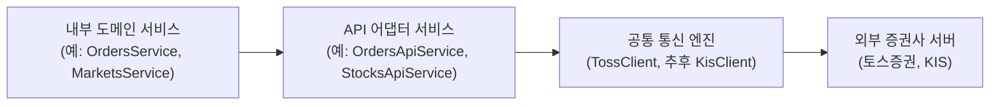
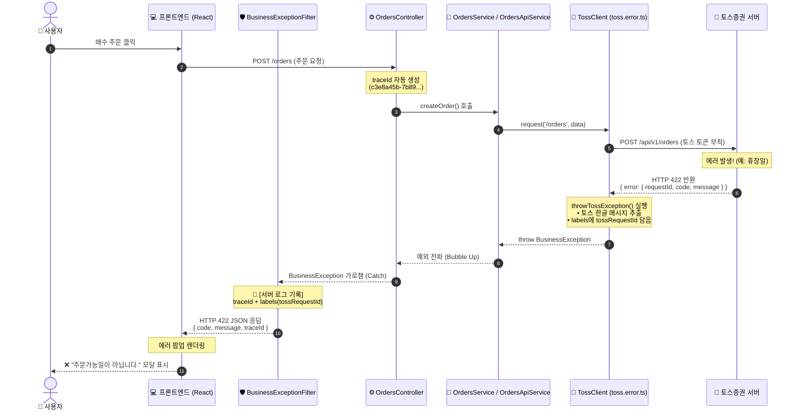

# API 도메인 명세서 및 외부 API 연동 가이드라인

API 도메인(`src/domains/api`)은 외부 금융기관 및 증권사(토스증권, 한국투자증권 등)의 OpenAPI와의 통신을 전담하는 공통 도메인입니다.
내부 도메인과의 결합도를 최소화하고, 토큰 관리, 에러 가공, 보안 및 트래킹을 일원화하는 **어댑터(Adapter) 기반 3계층 아키텍처**를 제공합니다.

---

## 1. 아키텍처 개요 (3-Layer Architecture)

외부 API 통신 시 각 도메인이 외부 서버와 직접 통신하지 않고, 공통 통신 엔진과 도메인별 API 어댑터를 거치도록 설계되었습니다.



### 계층별 역할
1. **내부 도메인 서비스 (Domain Service)**: 순수 비즈니스 로직 처리 및 API 어댑터 호출
2. **API 어댑터 (API Adapter Service)**: 외부 API의 Request/Response 스펙을 내부 비즈니스 DTO로 변환하고 인터페이스 추상화
3. **공통 통신 엔진 (Client Engine)**: OAuth2 토큰 발급/캐싱/재발급, 인증 헤더 자동 주입, 통신 에러 Envelope 파싱 및 예외 변환

---

## 2. 토스(Toss) OpenAPI 연동 세부 사양

### 1) 토큰 자동 관리 및 캐싱 (`TossClient`)
- **OAuth 2.0 인증**: Client Credentials Grant 방식을 기반으로 `POST /oauth2/token`을 통해 Access Token을 자동 발급 및 메모리에 캐싱합니다.
- **키 우선순위 (Priority)**:
  1. `users` 도메인에서 전달받은 사용자 연동 키 (`client_key`, `client_secret_key`) 최우선 적용
  2. 사용자 키 미지정 시 `.env`에 정의된 개발자 기본 키 자동 폴백(Fallback)
- **토큰 자동 갱신 및 재시도**:
  - API 호출 중 토큰이 만료(401 Unauthorized)되면 `TossClient` 내부에서 자동으로 토큰을 재발급받고 직전 요청을 재시도합니다.
- **인증 헤더 자동 주입**:
  - `Authorization: Bearer ${accessToken}`
  - `X-Tossinvest-Account`: 주문/계좌 관련 요청 시 필수 헤더 자동 처리

---

### 2) 에러 Envelope 파싱 및 CS 추적성 강화

토스증권 서버의 원본 에러 응답을 인터셉트하여, 백엔드 내부 표준 예외인 `BusinessException`으로 래핑하고 프론트엔드가 처리하기 용이한 규격으로 변환합니다.

#### 프론트엔드 최종 HTTP 에러 응답 규격
```json
{
  "code": "TOSS_ORDER_HOURS_CLOSED",
  "message": "주문가능일이 아닙니다.",
  "traceId": "c3e8a45b-7b89-4d2a-9f12-3456789abcde"
}
```

#### 에러 처리 및 로깅 시퀀스 다이어그램


---

### 3) 주문 API 어댑터 (`OrdersApiService`) 기능
- `createOrder()`: 매수 / 매도 주문 생성
- `cancelOrder()`: 미체결 주문 취소
- `getOrder()`: 주문 상태 및 체결 내역 단건/다건 조회

---

## 3. 실거래 보호 모드 및 테스트 가이드

실제 증권 계좌 연동 환경에서 테스트 코드 실행(`yarn test`) 시 의도치 않은 실제 주문이 나가는 것을 방지하기 위해 **안전 스위치**가 적용되어 있습니다.

### 안전 스위치 동작
* **기본 모드 (Default)**: 실제 주문 API가 전송되지 않고 안전 모드로 실행됩니다.
* **실거래 연동 테스트 실행 방법**:
  ```bash
  TOSS_LIVE_ORDER_ENABLED=true yarn test src/domains/api/orders-api/orders-api.service.spec.ts
  ```

---

## 4. 📖 신규 외부 API 연동 가이드라인 (타 도메인 개발자용)

타 도메인(예: `markets`, `assets` 등)에서 새로운 외부 API(종목 시세, 계좌 잔고 등)를 연동할 때 아래 4단계를 따라 구현합니다.

### Step 1. `src/domains/api/` 하위에 도메인 API 모듈 폴더 및 DTO/서비스 생성

예시: `src/domains/api/stocks-api/`

#### 1) DTO 정의 (`stocks-api.dto.ts`)
```typescript
// src/domains/api/stocks-api/stocks-api.dto.ts
export interface StockInfoResponseDto {
  symbol: string;
  name: string;
  price?: number;
  market?: string;
}
```

#### 2) 어댑터 서비스 구현 (`stocks-api.service.ts`)
```typescript
// src/domains/api/stocks-api/stocks-api.service.ts
import { Injectable, Logger } from '@nestjs/common';
import { TossClient } from '../clients/toss/toss.client';
import { TossStockResponse } from '../clients/toss/toss.types';
import { StockInfoResponseDto } from './stocks-api.dto';

@Injectable()
export class StocksApiService {
  private readonly logger = new Logger(StocksApiService.name);

  constructor(private readonly tossClient: TossClient) {}

  /**
   * 토스증권 종목 시세 정보 조회
   */
  async getStock(stockCode: string): Promise<StockInfoResponseDto> {
    this.logger.log(`[StocksApiService] 종목 조회 요청: ${stockCode}`);

    // tossClient.request()가 토큰 발급, 401 재시도, 에러 파싱을 자동 처리
    const rawResponse = await this.tossClient.request<TossStockResponse>(
      `/stocks?symbols=${encodeURIComponent(stockCode)}`,
      { method: 'GET' },
    );

    const stock = rawResponse.result[0];
    return {
      symbol: stock.symbol,
      name: stock.name,
      price: stock.price,
      market: stock.market,
    };
  }
}
```

---

### Step 2. `ApiModule`에 Provider 등록 및 Export

```typescript
// src/domains/api/api.module.ts
import { Module } from '@nestjs/common';
import { TossClient } from './clients/toss/toss.client';
import { OrdersApiService } from './orders-api/orders-api.service';
import { StocksApiService } from './stocks-api/stocks-api.service'; // 👈 추가

@Module({
  providers: [TossClient, OrdersApiService, StocksApiService],
  exports: [OrdersApiService, StocksApiService], // 👈 타 도메인 참조를 위해 export
})
export class ApiModule {}
```

---

### Step 3. 사용 도메인의 모듈에서 `ApiModule` Import

```typescript
// src/domains/markets/markets.module.ts
import { Module } from '@nestjs/common';
import { ApiModule } from 'src/domains/api/api.module'; // 👈 import
import { MarketsController } from './controllers/markets.controller';
import { MarketsService } from './services/markets.service';

@Module({
  imports: [ApiModule], // 👈 ApiModule 등록
  controllers: [MarketsController],
  providers: [MarketsService],
})
export class MarketsModule {}
```

---

### Step 4. 도메인 서비스에서 주입받아 사용

```typescript
// src/domains/markets/services/markets.service.ts
import { Injectable } from '@nestjs/common';
import { StocksApiService } from 'src/domains/api/stocks-api/stocks-api.service';

@Injectable()
export class MarketsService {
  constructor(
    private readonly stocksApiService: StocksApiService, // 👈 의존성 주입
  ) {}

  async getStockDetail(stockCode: string) {
    const stockInfo = await this.stocksApiService.getStock(stockCode);
    return stockInfo;
  }
}
```
