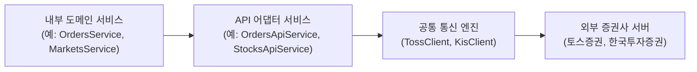

# API 도메인 신규 연동 가이드라인 (3-Layer Architecture)

API 도메인(`src/domains/api`)은 외부 금융기관 및 증권사(토스증권, 한국투자증권 등)의 OpenAPI와의 통신을 전담하는 공통 도메인입니다.
내부 도메인과의 결합도를 최소화하고, 토큰 관리, 에러 가공, 보안 및 트래킹을 일원화하는 **어댑터(Adapter) 기반 3계층 아키텍처**를 제공합니다.

---

## 1. 아키텍처 개요 (3-Layer Architecture)

외부 API 통신 시 각 도메인이 외부 서버와 직접 통신하지 않고, 공통 통신 엔진과 도메인별 API 어댑터를 거치도록 설계되었습니다.



### 계층별 역할
1. **내부 도메인 서비스 (Domain Service)**: 순수 비즈니스 로직 처리 및 API 어댑터 호출
2. **API 어댑터 (API Adapter Service)**: 외부 API의 Request/Response 스펙을 내부 비즈니스 DTO로 변환하고 인터페이스 추상화
3. **공통 통신 엔진 (Client Engine)**: OAuth2 토큰 발급/캐싱/재발급, 인증 헤더 자동 주입, 통신 에러 Envelope 파싱 및 예외 변환 (`TossClient`, `KisClient`)

---

## 2. 📖 신규 외부 API 연동 4단계 가이드 (타 도메인 개발자용)

타 도메인(예: `markets`, `trades`, `assets` 등)에서 새로운 외부 API(종목 시세, 체결 내역 등)를 연동할 때 아래 4단계를 따라 구현합니다.

---

### Step 1. `src/domains/api/` 하위에 도메인 API 모듈 폴더 및 DTO/서비스 생성

예시: `src/domains/api/stocks-api/`

#### 1) DTO 정의 (`stocks-api.dto.ts`)
```typescript
// src/domains/api/stocks-api/stocks-api.dto.ts
export interface StockInfoResponseDto {
  symbol: string;
  name?: string;
  price?: number;
  per?: number;
  pbr?: number;
  market?: string;
}
```

#### 2) 어댑터 서비스 구현 (`stocks-api.service.ts`)
```typescript
// src/domains/api/stocks-api/stocks-api.service.ts
import { Injectable, Logger } from '@nestjs/common';
import { KisClient } from '../clients/kis/kis.client';
import { KisStockPrice1Response } from '../clients/kis/kis.types';
import { StockInfoResponseDto } from './stocks-api.dto';

@Injectable()
export class StocksApiService {
  private readonly logger = new Logger(StocksApiService.name);

  constructor(private readonly kisClient: KisClient) {}

  /**
   * KIS 주식 현재가 시세 정보 조회
   */
  async getStock(stockCode: string): Promise<StockInfoResponseDto> {
    this.logger.log(`[StocksApiService] 종목 조회 요청: ${stockCode}`);

    // kisClient.request()가 토큰 발급, 헤더 주입, 401 재시도, 에러 변환을 자동 처리
    const rawResponse = await this.kisClient.request<KisStockPrice1Response>(
      `/uapi/domestic-stock/v1/quotations/inquire-price?FID_COND_MRKT_DIV_CODE=J&FID_INPUT_ISCD=${stockCode}`,
      {
        method: 'GET',
        trId: 'FHKST01010100', // 주식현재가 시세1
      },
    );

    const output = rawResponse.output;
    return {
      symbol: stockCode,
      price: output?.stck_prpr ? Number(output.stck_prpr) : undefined,
      per: output?.per ? Number(output.per) : undefined,
      pbr: output?.pbr ? Number(output.pbr) : undefined,
      market: output?.rprs_mrkt_kor_name,
    };
  }
}
```

---

### Step 2. `ApiModule`에 Provider 등록 및 Export

```typescript
// src/domains/api/api.module.ts
import { Module } from '@nestjs/common';
import { TossClient } from './clients/toss/toss.client';
import { KisClient } from './clients/kis/kis.client';
import { OrdersApiService } from './orders-api/orders-api.service';
import { StocksApiService } from './stocks-api/stocks-api.service'; // 👈 추가

@Module({
  providers: [TossClient, KisClient, OrdersApiService, StocksApiService],
  exports: [TossClient, KisClient, OrdersApiService, StocksApiService], // 👈 타 도메인 참조를 위해 export
})
export class ApiModule {}
```

---

### Step 3. 사용 도메인의 모듈에서 `ApiModule` Import

```typescript
// src/domains/markets/markets.module.ts
import { Module } from '@nestjs/common';
import { ApiModule } from 'src/domains/api/api.module'; // 👈 import
import { MarketsController } from './controllers/markets.controller';
import { MarketsService } from './services/markets.service';

@Module({
  imports: [ApiModule], // 👈 ApiModule 등록
  controllers: [MarketsController],
  providers: [MarketsService],
})
export class MarketsModule {}
```

---

### Step 4. 도메인 서비스에서 주입받아 사용

```typescript
// src/domains/markets/services/markets.service.ts
import { Injectable } from '@nestjs/common';
import { StocksApiService } from 'src/domains/api/stocks-api/stocks-api.service';

@Injectable()
export class MarketsService {
  constructor(
    private readonly stocksApiService: StocksApiService, // 👈 의존성 주입
  ) {}

  async getStockDetail(stockCode: string) {
    const stockInfo = await this.stocksApiService.getStock(stockCode);
    return stockInfo;
  }
}
```

---

## 3. 공통 클라이언트 엔진 사양 문서
- **한국투자증권(KIS) 클라이언트**: [`docs/api/kis.md`](file:///home/joshywoshy/MarshMallow/backend/src/docs/api/kis.md)
- **토스증권(Toss) 클라이언트**: [`docs/api/toss.md`](file:///home/joshywoshy/MarshMallow/backend/src/docs/api/toss.md)
