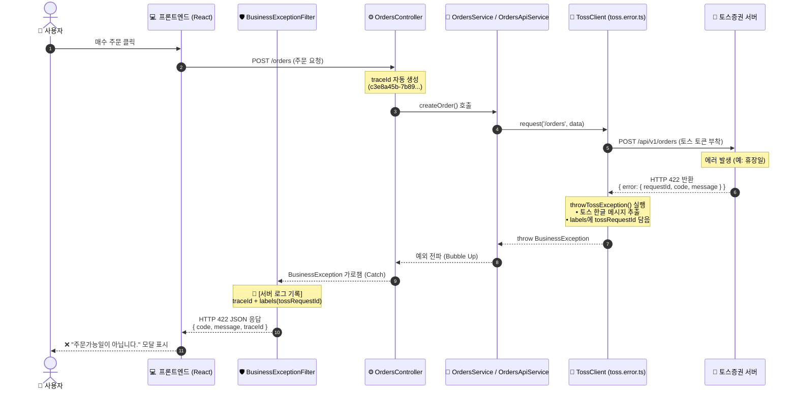

# 토스증권 (Toss) OpenAPI 연동 명세서

`TossClient`(`src/domains/api/clients/toss/toss.client.ts`)는 토스증권 OpenAPI와의 통신을 전담하는 공통 통신 엔진입니다.
주문 생성, 주문 취소, 주문 상세 조회 및 계좌 연동 기능을 지원합니다.

---

## 1. 주요 특징 및 사양

1. **OAuth 2.0 토큰 자동 관리 및 캐싱**:
   - Client Credentials Grant 방식을 기반으로 `POST /oauth2/token`을 호출하여 Access Token을 발급받고 메모리에 캐싱합니다.
2. **키 우선순위 (Priority)**:
   - **1순위**: `users` 도메인에서 전달받은 사용자 연동 키 (`clientKey`, `clientSecret`)
   - **2순위**: 미지정 시 `.env`에 정의된 개발자 기본 키 (`TOSS_CLIENT_KEY`, `TOSS_CLIENT_SECRET`) 자동 폴백(Fallback)
3. **토큰 자동 갱신 및 재시도**:
   - API 호출 중 토큰이 만료(401 Unauthorized)되면 `TossClient` 내부에서 자동으로 토큰을 재발급받고 직전 요청을 1회 재시도합니다.
4. **인증 헤더 자동 주입**:
   - `Authorization: Bearer ${accessToken}`
   - `X-Tossinvest-Account`: 주문/계좌 관련 요청 시 필수 헤더 처리

---

## 2. 에러 처리 및 CS 추적성 강화

토스증권 서버의 원본 에러 응답을 가로채어 백엔드 표준 예외인 `BusinessException`으로 래핑하고 프론트엔드와 CS 로그에 일관된 규격으로 전달합니다.

### 1) 프론트엔드 최종 HTTP 에러 응답 규격
```json
{
  "code": "TOSS_ORDER_HOURS_CLOSED",
  "message": "주문가능일이 아닙니다.",
  "traceId": "c3e8a45b-7b89-4d2a-9f12-3456789abcde"
}
```

### 2) 에러 처리 시퀀스 다이어그램


---

## 3. 주문 API 어댑터 (`OrdersApiService`)

토스증권과의 주문 통신을 추상화하여 내부 도메인(`orders`)에 표준화된 DTO를 제공합니다.

- `createOrder(dto)`: 매수 / 매도 주문 생성
- `cancelOrder(dto)`: 미체결 주문 취소
- `getOrder(orderId, accountSeq)`: 주문 상태 및 체결 내역 단건 조회

---

## 4. 실거래 보호 모드 및 테스트 가이드

실제 증권 계좌 연동 환경에서 테스트 코드 실행(`yarn test`) 시 의도치 않은 실제 주문이 나가는 것을 방지하기 위해 **안전 스위치**가 적용되어 있습니다.

```bash
# 기본 안전 모드 테스트
yarn test src/domains/api/clients/toss/toss.client.spec.ts

# 실제 주문 연동 테스트 (안전 스위치 해제)
TOSS_LIVE_ORDER_ENABLED=true yarn test src/domains/api/orders-api/orders-api.service.spec.ts
```
