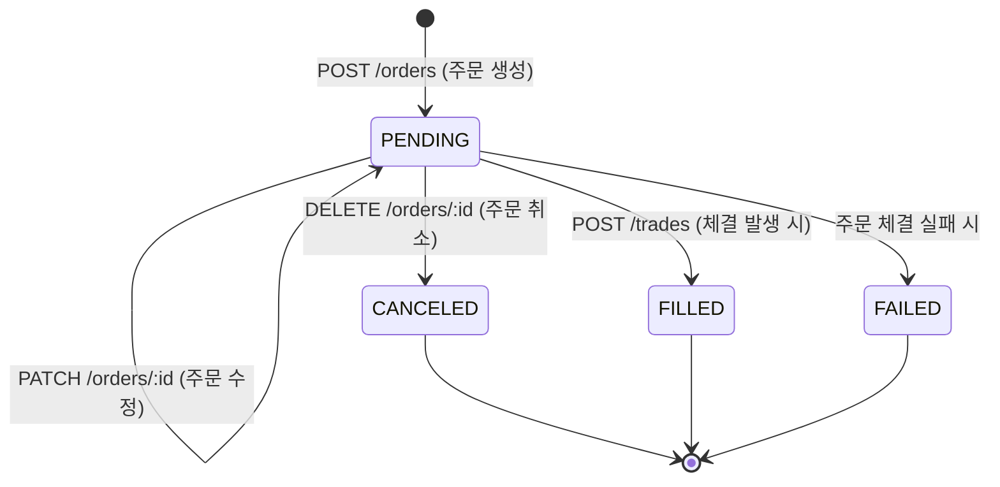

# Orders 도메인 명세서

Orders 도메인은 사용자의 주식 매수/매도 주문(Order)의 생성, 목록/단건 조회, 수정, 취소를 담당하는 핵심 도메인입니다.

---

## 1. 도메인 개요 및 엔티티 관계

- **Order (주문)**: 종목, 주문 종류(지정가/시장가), 주문 구분(일반/조건부), 매매 유형(매수/매도), 수량, 가격, 주문 당시 보조지표(PER, PBR, 시가총액) 및 상태를 관리합니다.
- **OrderCondition (조건부 주문 조건)**: `orderCategory === 'CONDITIONAL'`일 때 1:1로 연결되며, 감시 가격(`triggerPrice`) 및 만료 일시(`expiredAt`)를 가집니다.
- **Snapshot (스냅샷)**: 주문 시점의 차트 캡처 이미지 등 시각적 보조 자료와 1:1로 연계됩니다.

### 주문 상태 전이 (Order Status Lifecycle)



---

## 2. API 엔드포인트 명세

### 1) 주문 생성 (`POST /orders`)

로그인한 사용자의 신규 주식 주문을 생성합니다. 일반 주문과 감시 조건이 포함된 조건부 주문을 모두 지원합니다.

#### 입력값 (Request Body)
- `orderType`: 주문 유형 (`MARKET`: 시장가, `LIMIT`: 지정가) [필수]
- `orderCategory`: 주문 카테고리 (`GENERAL`: 일반, `CONDITIONAL`: 조건부) [필수]
- `tradeType`: 매매 구분 (`BUY`: 매수, `SELL`: 매도) [필수]
- `corpCode`: 종목 코드 (예: `005930`) [필수]
- `corpName`: 종목명 (예: `삼성전자`) [필수]
- `currenciesId`: 결제 통화 ID [필수]
- `quantity`: 주문 수량 (기본값: `1`, 1 이상 정수) [선택]
- `price`: 주문 단가 (지정가 주문 시 필수, 0 이상) [선택]
- `perAtOrder`, `pbrAtOrder`, `marketCapAtOrder`: 주문 시점 지표 스냅샷 [선택]
- `orderCondition`: 조건부 주문 설정 (`triggerPrice`, `expiredAt`) [`CONDITIONAL` 시 필수]

#### 처리 순서
1. `CurrenciesRepository`를 통해 요청된 `currenciesId`의 존재 여부를 검증한다.
2. 비즈니스 규칙을 검증한다:
   - 지정가(`LIMIT`) 주문인데 `price`가 없거나 0 이하인 경우
   - 일반(`GENERAL`) 주문인데 `orderCondition`이 포함된 경우
   - 조건부(`CONDITIONAL`) 주문인데 `orderCondition` 또는 필수 속성이 누락된 경우
3. 주문(`Order`) 레코드 및 조건부 주문(`OrderCondition`) 레코드를 데이터베이스 트랜잭션으로 원자적 생성한다.
4. 생성된 주문 정보를 `OrderResponseDto` 형태로 반환한다.

#### 검증 및 오류 코드
| HTTP 상태 | 오류 코드 | 발생 원인 |
| :--- | :--- | :--- |
| `400 Bad Request` | `LIMIT_ORDER_PRICE_REQUIRED` | 지정가 주문인데 유효한 `price`가 전달되지 않음 |
| `400 Bad Request` | `GENERAL_ORDER_CANNOT_HAVE_CONDITION` | 일반 주문에 `orderCondition` 필드가 포함됨 |
| `400 Bad Request` | `INVALID_ORDER_CONDITION` | 조건부 주문인데 `triggerPrice` 또는 `expiredAt`이 누락됨 |
| `404 Not Found` | `CURRENCY_NOT_FOUND` | 유효하지 않은 `currenciesId` 전달 |

---

### 2) 주문 목록 조회 (`GET /orders`)

로그인한 사용자의 주문 목록을 필터 조건에 맞추어 최신순으로 조회합니다.

#### 입력값 (Query Parameters)
- `status`: 주문 상태 필터 (`PENDING`, `FILLED`, `CANCELED`, `FAILED` - 기본값: `PENDING`)
- `orderCategory`: 주문 구분 필터 (`GENERAL`, `CONDITIONAL`)
- `orderType`: 주문 유형 필터 (`MARKET`, `LIMIT`)
- `tradeType`: 매매 구분 필터 (`BUY`, `SELL`)
- `corpCode`: 종목 코드 필터

#### 처리 순서
1. `userId`와 전달된 쿼리 파라미터를 조합하여 조회 조건을 구성한다.
2. `orderCondition` 및 `snapshot.image` 연관 관계를 `include`하여 `createdAt DESC` 순서로 조회한다.
3. 주문 엔티티 목록을 `OrderResponseDto[]`로 변환하여 반환한다.

---

### 3) 주문 단건 조회 (`GET /orders/:id`)

특정 주문의 상세 정보를 조회합니다.

#### 입력값 (Path Parameter)
- `id`: 주문 ID (`number`)

#### 처리 순서
1. `userId`와 `id`로 주문을 조회하여 본인 소유 주문인지 확인한다.
2. 주문이 존재하지 않거나 타인의 주문이면 `ORDER_NOT_FOUND` (404) 예외를 발생시킨다.
3. 연관된 조건부 주문 정보 및 스냅샷 이미지를 포함한 `OrderResponseDto`를 반환한다.

---

### 4) 주문 수정 (`PATCH /orders/:id`)

미체결(`PENDING`) 상태인 주문의 수량, 가격, 조건 등을 수정합니다.

#### 입력값 (Path Parameter & Request Body)
- `id`: 주문 ID (`number`)
- Body: 수정할 필드 (`quantity`, `price`, `corpCode`, `corpName`, `perAtOrder`, `pbrAtOrder`, `marketCapAtOrder`, `currenciesId`, `orderCondition`)

#### 처리 순서 및 동시성 방어
1. 데이터베이스 트랜잭션(`$transaction`) 내에서 주문을 조회하고 본인 소유 여부를 확인한다.
2. 주문 상태가 `PENDING`이 아니면 `ORDER_NOT_EDITABLE` (409) 예외를 발생시킨다.
3. 일반 주문에 조건부 필드를 추가하려는 경우 `GENERAL_ORDER_CANNOT_HAVE_CONDITION` (400) 예외를 발생시킨다.
4. 동시성 이슈를 방어하기 위해 `WHERE id = :id AND userId = :userId AND status = 'PENDING'` 조건으로 원자적 `updateMany`를 수행한다.
5. 수정된 영향 행 수가 0이면(그 사이 체결되거나 취소된 경우) `ORDER_NOT_EDITABLE` (409)를 발생시킨다.
6. 조건부 주문 정보가 있는 경우 `OrderCondition` 테이블도 함께 갱신하고 수정된 최신 주문 정보를 반환한다.

#### 오류 코드
| HTTP 상태 | 오류 코드 | 발생 원인 |
| :--- | :--- | :--- |
| `404 Not Found` | `ORDER_NOT_FOUND` | 주문이 존재하지 않거나 타인 소유 주문인 경우 |
| `409 Conflict` | `ORDER_NOT_EDITABLE` | 주문 상태가 `PENDING`이 아니어서 수정할 수 없는 경우 |
| `400 Bad Request` | `GENERAL_ORDER_CANNOT_HAVE_CONDITION` | 일반 주문에 조건을 추가하려고 시도한 경우 |

---

### 5) 주문 취소 (`DELETE /orders/:id`)

미체결(`PENDING`) 상태인 주문을 취소 처리합니다. (데이터베이스에서 물리 삭제하지 않고 상태를 `CANCELED`로 변경)

#### 입력값 (Path Parameter)
- `id`: 주문 ID (`number`)

#### 처리 순서
1. 데이터베이스 트랜잭션 내에서 주문 존재 및 소유권을 확인한다.
2. 주문 상태가 `PENDING`이 아니면 `ORDER_NOT_CANCELABLE` (409) 예외를 발생시킨다.
3. 원자적 쿼리(`updateMany with status = 'PENDING'`)로 주문 상태를 `CANCELED`로 갱신한다.
4. 취소 완료된 주문 상세 정보를 반환한다.

#### 오류 코드
| HTTP 상태 | 오류 코드 | 발생 원인 |
| :--- | :--- | :--- |
| `404 Not Found` | `ORDER_NOT_FOUND` | 주문이 존재하지 않거나 타인 소유 주문인 경우 |
| `409 Conflict` | `ORDER_NOT_CANCELABLE` | 주문 상태가 `PENDING`이 아니어서 취소할 수 없는 경우 |

---

## 3. 응답 구조 예시 (`OrderResponseDto`)

```json
{
  "data": {
    "id": 1,
    "orderType": "LIMIT",
    "orderCategory": "CONDITIONAL",
    "tradeType": "BUY",
    "quantity": 10,
    "price": 70000,
    "status": "PENDING",
    "corpCode": "005930",
    "corpName": "삼성전자",
    "perAtOrder": 12.5,
    "pbrAtOrder": 1.2,
    "marketCapAtOrder": 400000000000000,
    "currenciesId": 1,
    "createdAt": "2026-08-17T12:00:00.000Z",
    "orderCondition": {
      "id": 1,
      "triggerPrice": 69000,
      "expiredAt": "2026-08-31T23:59:59.000Z"
    },
    "snapshot": null
  }
}
```
