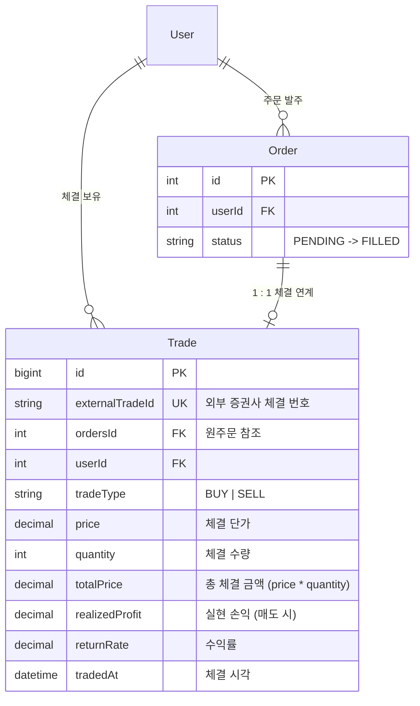

# Trades 도메인 명세서

Trades 도메인은 실제 체결된 주식 거래 내역(Trade)의 등록 및 조회를 관리하는 도메인입니다.

---

## 1. 도메인 개요 및 설계 원칙

### ① 거래 데이터의 불변성 (Immutability)
- 체결 내역은 법적/회계적 거래 증적 데이터이므로 **수정(PATCH/PUT)이나 삭제(DELETE) API를 일체 제공하지 않습니다.**
- 잘못된 거래 정정은 기존 체결을 삭제하는 것이 아니라 상쇄 거래(역거래)를 통해 처리하는 금융 도메인 원칙을 준수합니다.

### ② 주문-체결 원자적 상태 동기화
- 새로운 체결 내역(`Trade`)이 생성되면, 해당 체결과 연결된 원주문(`Order`)의 상태는 트랜잭션 내에서 즉시 `FILLED`(체결 완료)로 원자적으로 전이됩니다.

### ③ 외부 증권사 연동 멱등성 보장
- `externalTradeId` (외부 증권사 체결 고유 번호)에 `UNIQUE` 제약조건을 두어, 네트워크 재시도나 웹훅 중복 수신 시에도 동일 체결 건이 중복 생성되지 않도록 보장합니다.

### 도메인 관계도



---

## 2. API 엔드포인트 명세

### 1) 체결 내역 등록 (`POST /trades`)

주식 매수/매도 체결 내역을 기록하고, 연계된 주문의 상태를 `FILLED`로 갱신합니다.

#### 입력값 (Request Body)
- `externalTradeId`: 외부 증권사 체결 식별 번호 (`string`) [필수]
- `ordersId`: 체결 대상 원주문 ID (`number`) [필수]
- `tradeType`: 매매 구분 (`BUY`: 매수, `SELL`: 매도) [필수]
- `corpCode`: 종목 코드 (예: `005930`) [필수]
- `corpName`: 종목명 (예: `삼성전자`) [필수]
- `tradedAt`: 체결 시각 (ISO8601 문자열) [필수]
- `price`: 체결 단가 (0보다 큰 숫자) [필수]
- `quantity`: 체결 수량 (0보다 큰 정수) [필수]
- `currenciesId`: 통화 ID (`number`) [필수]
- `realizedProfit`: 실현 손익 (매도 체결 시 선택 입력)
- `returnRate`: 실현 수익률 (매도 체결 시 선택 입력)

#### 처리 순서
1. `price` 및 `quantity`가 0보다 큰지 유효성을 검증한다.
2. `currenciesId`의 존재 여부를 `CurrenciesRepository`를 통해 검증한다.
3. `externalTradeId`로 기존 체결 내역이 존재하는지 확인하여 중복이면 `DUPLICATE_EXTERNAL_TRADE_ID` (409)를 반환한다.
4. 데이터베이스 트랜잭션(`$transaction`) 내에서:
   - `ordersId`와 `userId`가 일치하는 원주문(`Order`)이 존재하는지 검증한다. (없으면 `ORDER_NOT_FOUND_FOR_TRADE` 404)
   - `totalPrice = price * quantity`를 계산하여 `Trade` 레코드를 생성한다.
   - 원주문의 상태를 `OrderStatus.FILLED`로 업데이트한다.
5. 생성된 체결 엔티티를 `TradeResponseDto`로 변환하여 반환한다.

#### 오류 코드
| HTTP 상태 | 오류 코드 | 발생 원인 |
| :--- | :--- | :--- |
| `400 Bad Request` | `INVALID_TRADE_PRICE_OR_QUANTITY` | 단가 또는 수량이 0 이하인 경우 |
| `404 Not Found` | `CURRENCY_NOT_FOUND` | 유효하지 않은 `currenciesId` 전달 |
| `404 Not Found` | `ORDER_NOT_FOUND_FOR_TRADE` | 연계할 원주문(`ordersId`)이 없거나 타인 소유인 경우 |
| `409 Conflict` | `DUPLICATE_EXTERNAL_TRADE_ID` | 이미 등록된 `externalTradeId`로 다시 등록 요청한 경우 |

---

### 2) 체결 내역 목록 조회 (`GET /trades`)

로그인한 사용자의 체결 내역을 기간/종목/매매유형/원주문 조건으로 필터링하여 페이지 단위로 조회합니다.

#### 입력값 (Query Parameters)
- `page`: 페이지 번호 (0부터 시작, 기본값: `0`)
- `size`: 한 페이지당 항목 수 (기본값: `10`)
- `startDate`, `endDate`: 체결 시각(`tradedAt`) 기준 조회 기간 (ISO8601)
- `corpCode`: 종목 코드 필터
- `tradeType`: 매매 유형 필터 (`BUY`, `SELL`)
- `ordersId`: 특정 주문과 연계된 체결 필터

#### 처리 순서
1. `page`, `size`에 기본값을 적용하고 `skip`, `take`를 계산한다.
2. `userId`와 전달된 필터 조건을 조합하여 `Prisma.TradeWhereInput`을 구성한다.
3. 체결 내역 목록(`findMany`)과 총 개수(`count`)를 `Promise.all`로 병렬 조회한다. (정렬: `tradedAt DESC`)
4. 페이지네이션 메타데이터(`page`, `size`, `totalCount`, `totalPages`, `hasNext`)와 함께 `TradeListResponseDto`로 반환한다.

---

### 3) 체결 내역 단건 조회 (`GET /trades/:id`)

특정 체결 내역의 상세 정보를 조회합니다.

#### 입력값 (Path Parameter)
- `id`: 체결 ID (`string` 형태의 BigInt ID)

#### 처리 순서
1. `id` 파라미터를 `BigInt`로 변환한다. (변환 실패 시 `TRADE_NOT_FOUND` 404)
2. `userId`와 `id` 조건으로 체결 내역을 조회한다.
3. 내역이 없거나 타인의 체결이면 `TRADE_NOT_FOUND` (404) 예외를 발생시킨다.
4. 조회된 체결 데이터를 `TradeResponseDto`로 변환하여 반환한다.

#### 오류 코드
| HTTP 상태 | 오류 코드 | 발생 원인 |
| :--- | :--- | :--- |
| `404 Not Found` | `TRADE_NOT_FOUND` | 체결 내역이 존재하지 않거나 타인 소유인 경우 |

---

## 3. 응답 구조 예시

### 단건 응답 (`TradeResponseDto`)
```json
{
  "data": {
    "id": "1",
    "externalTradeId": "EXT-20260817-001",
    "ordersId": 1,
    "tradeType": "BUY",
    "corpCode": "005930",
    "corpName": "삼성전자",
    "tradedAt": "2026-08-17T12:05:00.000Z",
    "price": 70000,
    "quantity": 10,
    "totalPrice": 700000,
    "realizedProfit": null,
    "returnRate": null,
    "currenciesId": 1,
    "createdAt": "2026-08-17T12:05:01.000Z"
  }
}
```

### 목록 응답 (`TradeListResponseDto`)
```json
{
  "data": {
    "items": [
      {
        "id": "1",
        "externalTradeId": "EXT-20260817-001",
        "ordersId": 1,
        "tradeType": "BUY",
        "corpCode": "005930",
        "corpName": "삼성전자",
        "tradedAt": "2026-08-17T12:05:00.000Z",
        "price": 70000,
        "quantity": 10,
        "totalPrice": 700000,
        "realizedProfit": null,
        "returnRate": null,
        "currenciesId": 1,
        "createdAt": "2026-08-17T12:05:01.000Z"
      }
    ],
    "page": 0,
    "size": 10,
    "totalCount": 1,
    "totalPages": 1,
    "hasNext": false
  }
}
```
