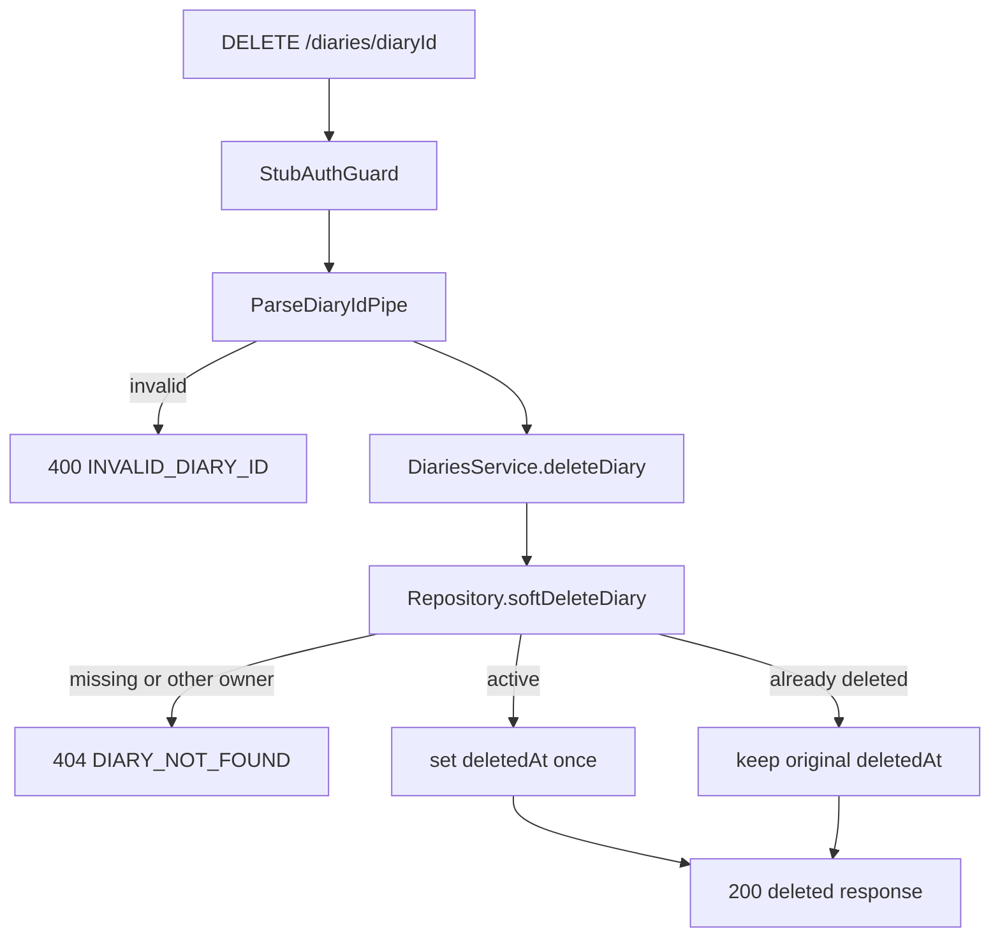

# DELETE /diaries/{diaryId} — DB 연결 직전 구현

- 작성자: `8t-truck`
- 기준 명세: [Notion DELETE /diaries/{diaryId}](https://app.notion.com/p/3a8fb8dfa1c38044875ccd5de9164b35)
- 작업일: 2026-08-16

## 작업 범위

- NestJS Controller → Service → Repository 포트까지 DELETE 요청 흐름을 연결했다.
- 실제 Prisma Repository와 DB 트랜잭션 구현은 다음 단계로 남겼다.
- TDD로 정상 삭제, 재삭제 멱등성, 미존재·타인 소유 404 정책을 먼저 고정했다.

## 구현 계약

- `DELETE /diaries/{diaryId}`는 인증된 사용자 본인의 일기만 삭제한다.
- 삭제는 레코드를 제거하지 않고 `deletedAt`을 기록하는 soft delete다.
- 이미 삭제된 본인 일기를 다시 삭제하면 최초 `deletedAt`을 유지해 200을 반환한다.
- 미존재 일기와 타인 소유 일기는 모두 `DIARY_NOT_FOUND`로 처리해 존재 여부를 숨긴다.
- 잘못된 경로 ID는 기존 `ParseDiaryIdPipe`에서 `INVALID_DIARY_ID`로 처리한다.
- 저장소의 `softDeleteDiary` 한 번으로 조회·갱신·결과 반환을 수행해 DB 연결 시 원자성을 보장할 경계를 마련했다.

## TDD 기록

### Red

- 본인 소유 일기의 soft delete 결과 반환 테스트를 추가했다.
- 이미 삭제된 일기에 대한 재요청이 같은 결과를 반환하는 테스트를 추가했다.
- 미존재·타인 소유를 대표하는 저장소 `null` 결과가 `DIARY_NOT_FOUND`가 되는 테스트를 추가했다.
- 구현 전 테스트 결과: 신규 3개 실패, 기존 25개 통과.

### Green

- `DeleteDiaryResponseDto`를 추가했다.
- `DiariesService.deleteDiary`와 `DiariesRepository.softDeleteDiary` 포트를 추가했다.
- Controller DELETE 라우트와 Swagger 성공·오류 계약을 추가했다.
- DB 미연결 상태의 Repository Stub에도 새 포트를 연결했다.

### Refactor

- 삭제 시각 생성과 멱등성 판단을 서비스에서 분리해 저장소 트랜잭션 책임으로 명시했다.
- 서비스는 HTTP/Prisma 세부사항 없이 성공 결과 또는 도메인 404만 결정한다.

## 요청 흐름

## 다음 작업: DB 연결

1. Prisma 기반 `DiariesRepository` 구현체에 `softDeleteDiary`를 구현한다.
2. `userId + diaryId`로 삭제 여부와 무관하게 본인 소유 행을 조회한다.
3. 활성 행에만 `deletedAt = now()`를 기록하고 이미 삭제된 행은 기존 값을 유지한다.
4. 조회·조건부 갱신·응답 매핑을 하나의 트랜잭션으로 처리한다.
5. 활성 일기 유일성 정책이 soft delete 행을 제외하는지 DB 제약을 확인한다.
6. 목록·상세 조회가 `deletedAt: null` 조건을 적용하는지 Repository 통합 테스트로 검증한다.
7. 최초 삭제와 재삭제, 타인 소유, 미존재, 잘못된 ID에 대한 E2E 테스트를 추가한다.

## 검증

- DiariesService 단위 테스트: 28개 통과
- Nest build: 통과
- 전체 회귀 테스트: 9 suites, 75 tests 통과
- Diaries 및 E2E ESLint: 통과
