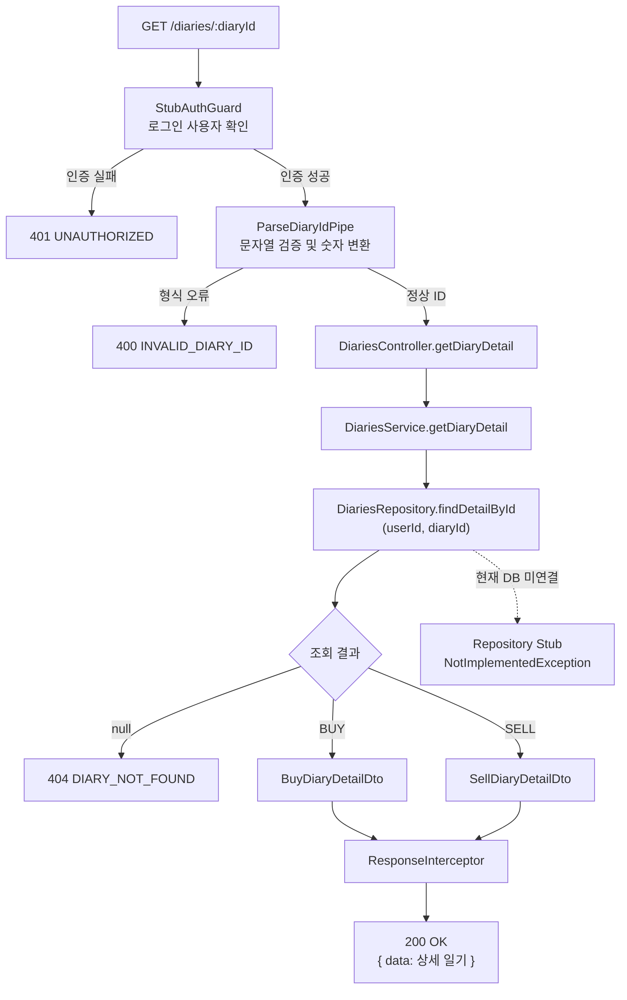
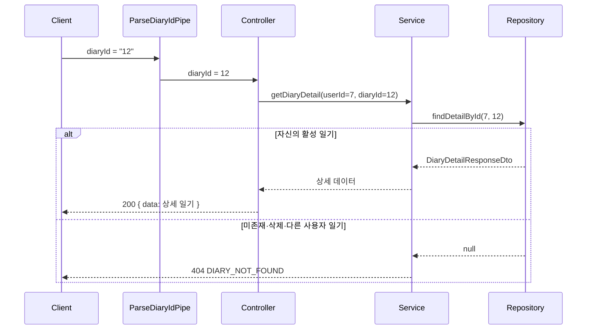
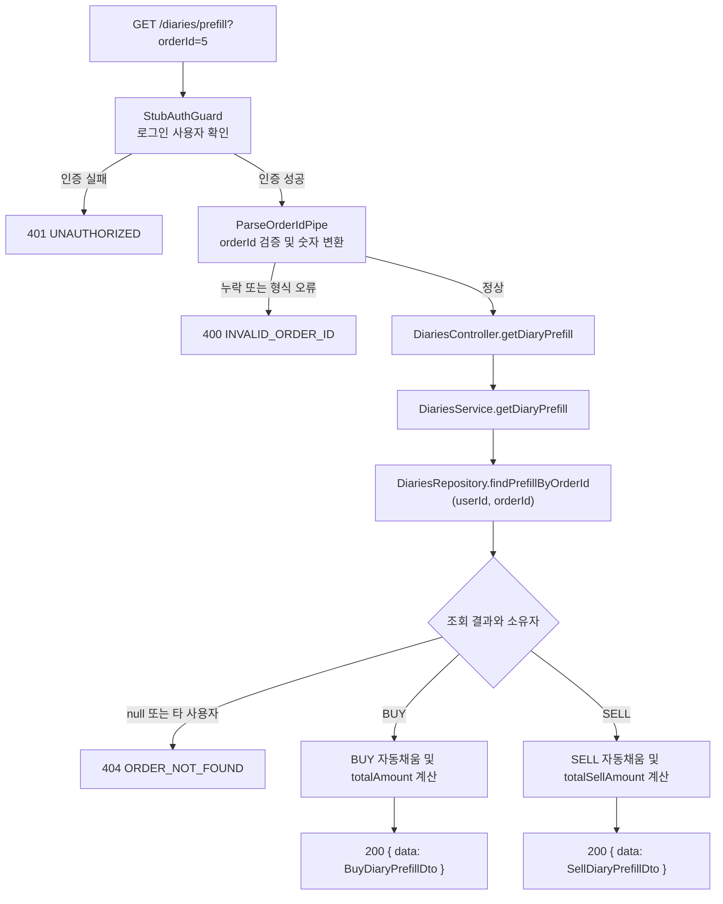

# 2026-08-15 WORKLOG

## 작업 범위

- `GET /diaries/{diaryId}`를 Controller, Service, Repository 포트까지 구현
- 실제 Prisma 조회 구현과 DB 연결은 제외
- 잘못된 ID는 `INVALID_DIARY_ID`, 미존재 또는 타 사용자 일기는 `DIARY_NOT_FOUND`로 처리
- BUY/SELL 상세 응답 타입과 단위 테스트 추가

## 구현 결정

- Repository의 `findDetailById(userId, diaryId)`가 소유권 조건까지 포함해 조회하도록 계약했다.
- 조회 결과가 `null`이면 Service에서 일관되게 404로 변환해 타 사용자 리소스의 존재 여부를 숨긴다.
- `diaryId`는 전용 Pipe에서 양의 안전 정수인지 검증한다.
- API 명세의 응답 필드명은 호환성을 위해 그대로 유지했다.

## 전체 흐름

## 소유권 보호 흐름

Repository 조회 조건에 `userId`를 포함한다. 따라서 존재하지 않는 일기, 삭제된 일기, 다른 사용자의 일기는 모두 `null`로 처리되며 클라이언트에는 동일한 404 응답이 전달된다.

## Prisma 스키마와 API 명세 차이

1. API의 `perAtTrade`, `pbrAtTrade`, `marketCapAtTrade`는 Prisma에서 각각 `perAtOrder`, `pbrAtOrder`, `marketCapAtOrder`다. 현재 데이터가 주문 시점 스냅샷이므로 DB 구현 시 명시적인 필드 매핑이 필요하다.
2. API의 `candelChartAtUrl`은 철자가 `candel`이지만 Prisma에는 URL 컬럼이 직접 없고 `Order.snapshot -> Snapshot.image -> Image.imageUrl` 관계로 저장된다. API 호환을 위해 DTO는 명세 철자를 유지했다.
3. API의 `orderedAt`에 대응하는 전용 Prisma 컬럼은 없다. 현재 주문 시각으로 사용할 수 있는 후보는 `Order.createdAt`뿐이므로 DB 구현 전에 의미 확인이 필요하다.
4. BUY의 `price`, `totalAmount`는 Diary에 저장되지 않는다. `Order.price`, `Order.quantity`로 조회/계산해야 하며 `Order.price`는 nullable이라 API 예시의 항상 존재하는 숫자와 차이가 있다.
5. SELL의 `averagePrice`, `sellPrice`, `totalBuyAmount`, `totalSellAmount`, `realizedProfit`, `returnRate`는 Diary/SellDiary에 직접 저장되지 않는다. Trade 집계 기준과 다중 체결 처리 규칙이 필요하다.
6. Prisma의 `perAtOrder`, `pbrAtOrder`, `marketCapAtOrder`, `Order.price` 및 매매 지표는 nullable일 수 있지만 API 성공 예시는 non-null 숫자로만 표현되어 있다. DTO는 실제 스키마 가능성을 반영해 nullable로 두었다.
7. Prisma `BuyDiary.customGoalHoldPeriod`는 API 상세 응답에 없다. `goalHoldPeriod`가 `CUSTOM`인 경우 상세 화면에 값이 필요한지 명세 보완이 필요하다.

## DB 연결 시 후속 작업

- Prisma 기반 `DiariesRepository` 구현체 작성 및 Module 바인딩 교체
- `userId`, `diaryId`, `deletedAt: null` 조건을 하나의 조회에 포함
- BUY/SELL 관계를 유형에 맞게 include하고 Decimal/Date를 API 타입으로 변환
- 주문·체결 기반 가격 및 수익 지표의 계산 규칙 확정
- Controller E2E 테스트 추가

---

## GET /diaries/prefill 구현

### 작업 범위

- `GET /diaries/prefill?orderId={orderId}`를 Controller, Service, Repository 포트까지 구현
- 실제 Prisma 조회 구현과 DB 연결은 제외
- TDD 순서로 Pipe와 Service 실패 테스트를 먼저 작성한 뒤 최소 구현 추가
- `orderId` 누락 또는 형식 오류는 `INVALID_ORDER_ID`로 처리
- 미존재 주문과 타 사용자 주문은 동일한 `ORDER_NOT_FOUND`로 처리

### 구현 흐름

### buyPrice 보류 결정

- SELL의 `buyPrice`는 해당 회사의 사용자 평단 조회 방식으로 제공할 예정이다.
- 평단 조회 규칙과 데이터 소스가 확정될 때까지 `buyPrice`와 `totalBuyAmount`는 `null`을 허용한다.
- 현재는 `sellPrice × quantity`로 `totalSellAmount`만 계산한다.
- 향후 DB Repository 구현 시 회사별 평단 조회를 추가하고 기존 Service 계약에 값을 전달한다.

### 테스트 시나리오

- 양의 정수 `orderId` 변환
- 누락, 0 이하, 소수, 문자열, 앞자리 0, 안전 정수 초과 거부
- BUY 가격·수량 기반 `totalAmount` 계산
- BUY 가격이 없으면 `totalAmount: null`
- SELL의 `buyPrice` 보류 및 `totalBuyAmount: null`
- SELL 가격·수량 기반 `totalSellAmount` 계산
- 미존재 주문 및 타 사용자 주문의 동일한 404 처리
- Repository가 잘못된 소유자의 스냅샷을 반환하는 경우 Service의 이중 방어

### DB 연결 시 후속 작업

- `userId + orderId` 조건으로 Order, Snapshot/Image, Trade를 조회하는 Prisma Repository 구현
- `orderedAt`을 `Order.createdAt`으로 매핑할지 최종 확인
- 회사별 사용자 평단 조회 규칙을 확정하고 `buyPrice` 연결
- 체결 데이터가 있으면 `realizedProfit`, `returnRate`를 가져오는 기준 확정
- 실제 Repository를 연결한 Controller E2E 테스트 추가
